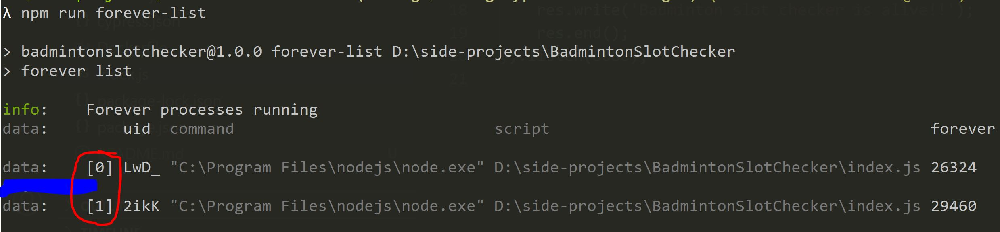

# Automated Badminton slot booking

## Getting started
1. Install [Node.js](https://nodejs.org/en/download/)
2. Clone this repo
3. The booking system requires login credentials and email addresses.
 - For privacy reasons, we don't want the creds to be in the github repo
 - After cloning the repo, make a copy of the [`src/sample-creds.js`](./src/sample-creds.js) file and rename it to `authCreds.js`
 - Add the information to the fields in that file and READ THE COMMENTS BEFORE FILLING THEM!!
 
 #### **Note:** I have already added `./src/authcreds.js` to `.gitignore` so it won't get pushed to github.

4. Now, from root of the repo, run `npm install`. This might take some time because of cypress.
5. In [`BookingUtils.js`](./src/cypress/BookingUtils.js) make sure `daysToBookFor` and `slotToBookByDay` have correct values set in them.
-  Change them as needed.
6. From the root of the repo, Run `npm start` and voila the tool should take care of the bookings for ya!

## Stopping the app
- Run `npm run forever-list`. This will list all the instances of the app.

- Run `npm run forever-stop <id>` where `<id>` will be something inside the red circle above.
**Note:** Start with bigger id first to avoid errors, the ids get shifted apparently.